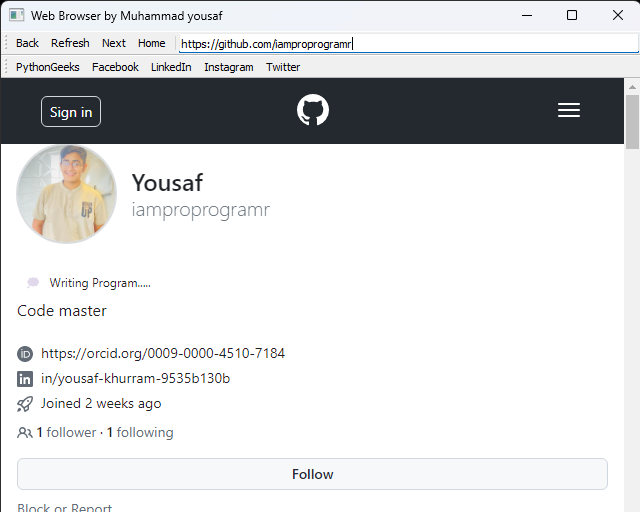

Here's the README file for your Web Browser project:


# Web Browser

This program is written by Muhammad Yousaf.
Email: yousafsahiwal3@gmail.com

## Description

This Web Browser application is built using PyQt5 in Python. It provides basic web browsing functionalities such as navigation, bookmarks, and URL entry. Users can navigate to different websites, refresh pages, go back and forward, and manage bookmarks.

## Features

- Navigate to different websites.
- Refresh pages.
- Go back and forward in browsing history.
- Manage bookmarks for frequently visited websites.

## Getting Started

### Prerequisites

- Python 3.x
- PyQt5 library

### Installation

1. Clone the repository or download the source code.

```bash
git clone https://github.com/iamproprogramr/Web-browser.git
```

2. Install the required libraries.

```bash
pip install pyqt5
```

### Running the Program

Run the `web_browser.ipynb` file to start the application.

```bash
python web_browser.ipynb
```

## Usage

1. **Navigation**: Use the navigation toolbar to go back, forward, refresh, or return to the home page.
2. **Bookmarks**: Access frequently visited websites quickly using bookmarks.
3. **URL Entry**: Enter the URL directly into the address bar to navigate to a specific website.
## OUTPUT



## Code Overview

The main components of the code include:

- **Web Browser Window**: Creates the main window for the web browser application.
- **Navigation Toolbar**: Implements navigation buttons for back, forward, refresh, and home.
- **Address Bar**: Allows users to enter URLs directly for navigation.
- **Bookmarks Toolbar**: Provides quick access to bookmarked websites.

## Contact

For any inquiries or assistance, please contact the project owner:

- **Muhammad Yousaf**
- **Email**: yousafsahiwal3@gmail.com

## License

This project is licensed under the MIT License.
```
